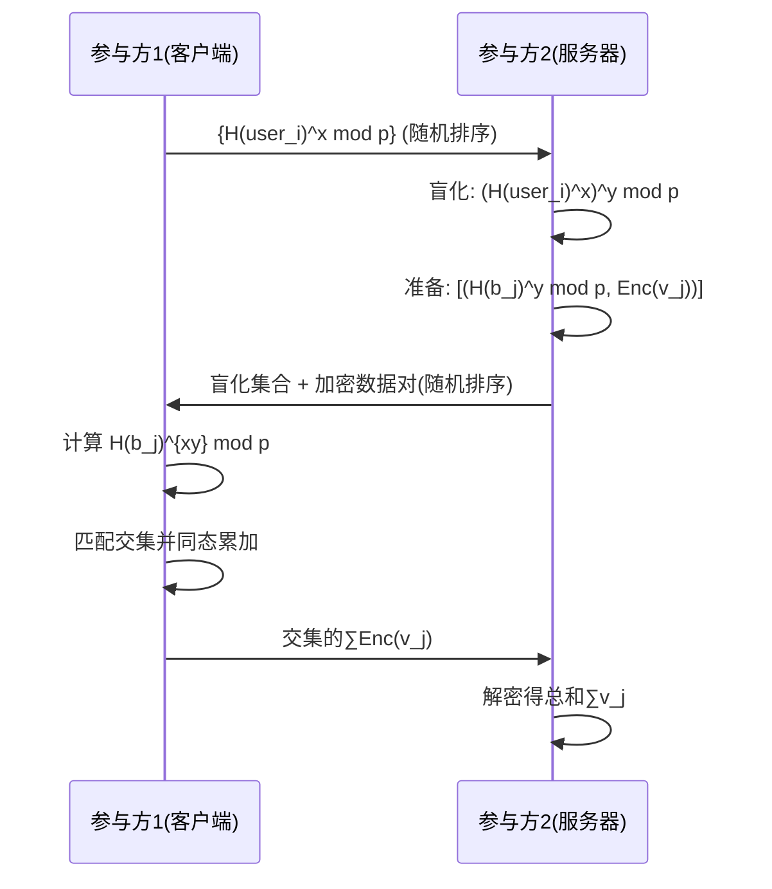

# 私有集合交集与值求和协议实现报告

## 实验原理

本实验基于论文 *Google Password Checkup* (CCS'19) 提出的**私有交集求和协议**（PSI with sum），实现了一个安全多方计算协议。该协议满足以下安全特性：
1. **隐私保护**：双方无法获取对方集合中非交集元素的信息
2. **最小信息泄露**：仅输出交集大小和关联值的总和
3. **半诚实模型**：假设各方遵守协议但会尝试推断额外信息

### 核心数学原理
1. **Diffie-Hellman 密钥交换**
   - 在素阶群 $G$ 上建立共享秘密：
     $K = g^{(x \cdot y)} \mod p$
2. **Paillier 加法同态加密**
   - 加密特性：$E(a) \cdot E(b) = E(a + b) \mod N^2$
   - 解密函数：$D(c) = \frac{[c^\lambda \mod N^2] - 1}{N} \cdot \mu \mod N$
3. **盲化技术**
   - 通过随机置换和双重盲化实现数据混淆：
     $H(a)^x \rightarrow (H(a)^x)^y = H(a)^{xy}$

## 协议流程（Figure 2 实现）


## 代码实现部分

#### 1. 基础加密组件
```python
class CryptoCore:
    @staticmethod
    def is_likely_prime(n: int, rounds: int = 128) -> bool:
        # 实现米勒-拉宾素数检测算法
        # 通过多轮随机测试确保高概率准确度
    
    @staticmethod
    def generate_random_prime(size: int) -> int:
        # 生成指定位数的随机素数
        # 通过随机数生成和素数检测循环实现
    
    @staticmethod
    def modular_inverse(a: int, m: int) -> int:
        # 使用内置pow函数计算模逆元
```

#### 2. 同态加密引擎
```python
class HiddenDataEngine:
    def __init__(self, bit_length: int = 1024):
        # 基于Paillier加密方案初始化
        # 生成大素数p1, p2，计算N=p1*p2
        # 预计算解密所需参数_lambda和_mu
    
    def conceal(self, data: int) -> int:
        # 加密数据：E(m) = (gᵐ·rᴺ) mod N²
        # 添加随机性确保语义安全
    
    def unseal(self, encrypted_data: int) -> int:
        # 解密：m = L(cᵠ mod N²)·μ mod N
        # 使用预存的私钥参数
    
    @staticmethod
    def combine(c1: int, c2: int, mod_squared: int) -> int:
        # 同态加法：E(m1) ⊗ E(m2) = E(m1+m2)
        # 通过密文相乘实现
```

#### 3. 安全群操作
```python
class DiffieHellmanGroup:
    def __init__(self, key_length: int = 512):
        # 构建安全素数群：p=2q+1
        # 生成原根g作为生成元
    
    def get_context(self) -> Tuple[int, int, int]:
        # 返回群参数(p, q, g)
    
    def process_element(self, element: str, power: int) -> int:
        # 将字符串哈希到群元素：H(element)
        # 应用指数运算：g^{H(element)·secret} mod p
```

#### 4. 协作计算协议流程
```python
def collaborative_computation(data_provider_1, data_provider_2):
    # 阶段1: 系统初始化
    shared_group = DiffieHellmanGroup()  # 建立公共参数
    secret_A = random.randint(1, Q-1)    # 参与方1生成秘密
    secret_B = random.randint(1, Q-1)     # 参与方2生成秘密
    paillier = HiddenDataEngine()         # 初始化同态加密

    # 阶段2: 数据预处理
    # 方1: 混淆并加密标识符 H(ID)^sA
    # 方2: 双重处理数据 [H(ID)^(sA·sB)], (H(ID)^sB, E(value))

    # 阶段3: 安全匹配与求和
    # 方1: 通过二次映射确认匹配项
    # 使用同态加法聚合匹配值

    # 阶段4: 结果揭示
    # 方2解密获得最终求和结果
```

### 结果分析

#### 测试数据集
```python
alpha_data = ["userA", "userB", "userC", "userD"]
beta_data = [("userA", 100), ("userC", 200), ("userE", 50), ("userF", 75)]
```

#### 执行结果
```
--- 系统初始化阶段 ---
初始化完毕。各方已拥有秘密参数。

--- 阶段一：数据封装 ---
方1已处理其集合。

--- 阶段二：交叉处理 ---
方2已完成对两组数据的交叉处理和封装。

--- 阶段三：数据匹配与汇总 ---
方1已完成匹配和数据累加。

--- 结果揭示阶段 ---
最终结果已由方2解密。
匹配项数量: 2
匹配项关联值总和: 300

--- 最终核对 ---
预期匹配数量: 2
预期总和: 300
核对成功！
```


