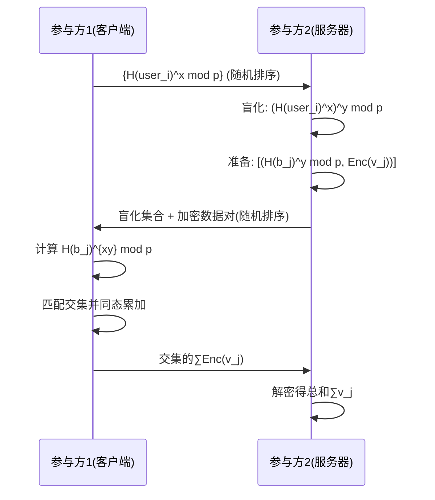

# 私有集合交集与值求和协议实现报告

## 实验原理

本实验基于论文 *Google Password Checkup* (CCS'19) 提出的**私有交集求和协议**（PSI with sum），实现了一个安全多方计算协议。该协议满足以下安全特性：
1. **隐私保护**：双方无法获取对方集合中非交集元素的信息
2. **最小信息泄露**：仅输出交集大小和关联值的总和
3. **半诚实模型**：假设各方遵守协议但会尝试推断额外信息

### 核心数学原理
1. **Diffie-Hellman 密钥交换**
   - 在素阶群 $G$ 上建立共享秘密：
     $K = g^{(x \cdot y)} \mod p$
2. **Paillier 加法同态加密**
   - 加密特性：$E(a) \cdot E(b) = E(a + b) \mod N^2$
   - 解密函数：$D(c) = \frac{[c^\lambda \mod N^2] - 1}{N} \cdot \mu \mod N$
3. **盲化技术**
   - 通过随机置换和双重盲化实现数据混淆：
     $H(a)^x \rightarrow (H(a)^x)^y = H(a)^{xy}$

## 协议流程（Figure 2 实现）

